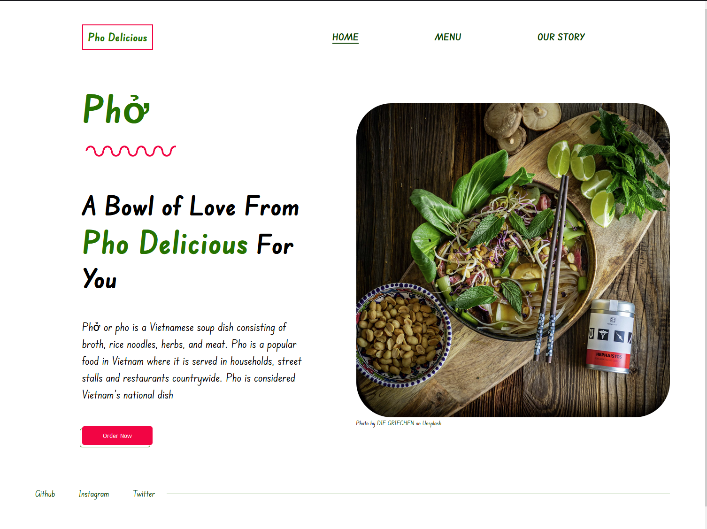

# The Odin Project - Project: Restaurant Page

This is a solution to the [Project: Restaurant Page on Odin](https://www.theodinproject.com/lessons/node-path-javascript-restaurant-page). 

## Overview

A simple restauarant homepage using Javascript alone to generate the entire contents of the website!

### Screenshot



### Links

- Live Site URL: [https://selt0.github.io/restaurant-page/](https://selt0.github.io/restaurant-page/)

## My process

### Built with

- Semantic HTML5 markup
- CSS custom properties
- Flexbox
- CSS Grid
- Webpack

### What I learned

I used <code>webpack</code> to compile all the modules. I'm used to creating the content within HTML so I had a slow start but once I got got in the rhythm, the webpage really came together.  
I set an event listener on the nav and created a function that would remove the section and replace it with the new content. Since there was only one section on each page, I did a simple query selector for <code>section</code>.   
During the creation of the menu, I began realizing how tedious it was to create the menu items, so I created a seperate module and a data structure to hold the menu items. then I used a loop to go through each item creating the HTML.  

I used css variables to make it easier to change the colors throughout the app in one easy location. I also used Grid to create a responsive menu using <code> repeat(autofit) </code>

```css
:root {
    --red: #F20544;
    --brown: #A68C6D;
    --green: #267302;
    --dark-green: #0A4001;
}

.menu-container {
    display: grid;
    grid-template-columns: repeat(auto-fit, min(500px, 100%));
    ...
}
```

```js
function loadPage(e){
    // do nothing unless user clicks directly on nav item
    if (!e.target.classList.contains('nav-item')) return
    // do nothing if user clicks on nav item showing current page
    if (e.target.classList.contains('active')) return

    document.querySelector('section').remove()
    const footer = document.querySelector('footer')
    setNavActiveItem(e.target)

    if (e.target.textContent === 'Menu'){
        contentContainer.insertBefore(createMenu(), footer)
    } else if (e.target.textContent === 'Home'){
        contentContainer.insertBefore(createHomepage(), footer)
    } else {
        contentContainer.insertBefore(createStory(), footer)
    }
}

const menuItems = {
    'Appetizers': [
        {
            name: 'APPETIZER SAMPLER / Khai Vị Đặc Biệt',
            description: '(2) Spring Rolls, (2) Egg Rolls, (2) Shrimp Sausage Wrap, and (4) Shrimp Wrap'
        },
        {
            name: 'VEGETARIAN SPRING ROLLS (2) / Gỏi Cuốn Chay',
            description: 'Rice paper freshly wrapped around Tofu, iceberg lettuce, basil, beansprouts and vermicelli served with house special peanut sauce'
        },
        {
            name: 'EDAMAME'
        },
        {
            name: 'FRIED OR STEAMED DUMPLING (5)',
            description: 'An irresistible dumplings filled with ground pork and vegetables served with special dumpling sauce.'
        }
    ],
    'PHỞ': [
        {
            name: 'KOBE BEEF Phở',
        },
        {
            name: 'FILET MIGNON Phở'
        },

        {
            name: 'SHRIMP PHO / Phở Tôm'
        },
        {
            name: 'PHỞ SPECIAL / Đặc Biệt',
            description: 'A hearty combination of eye-round steak, well-done flank, tripe, beef meatballs, well-done brisket, and soft tendon.'
        },
    ...
    ...
    ...
    ]
}

function populateMenu(){
    const menuContainer = document.createElement('div')
    menuContainer.classList.add('menu-container')

    for (const category in menuItems){
        const menuCard = document.createElement('div')
        menuCard.classList.add('menu-card')
        menuContainer.appendChild(menuCard)

        const h2 = document.createElement('h2')
        h2.textContent = category
        h2.classList.add('category')
        menuCard.appendChild(h2)

        menuItems[category].forEach(item => {
            const menuItemContainer = document.createElement('div')
            menuItemContainer.classList.add('menu-item')
            menuCard.appendChild(menuItemContainer)

            const name = document.createElement('p')
            name.classList.add('item-name')
            name.textContent = item.name
            menuItemContainer.appendChild(name)

            if (item.description) {
                const description = document.createElement('p')
                description.classList.add('item-description')
                description.textContent = item.description
                menuItemContainer.appendChild(description)
            }
        })
    }

    return menuContainer
}
```

### Continued development

I'm noticing the hardest part of projects is the initial phase. I get a little overwhelmed on how to start. Where should I begin? How should I design my code? How do I want the app to look? Just goes to show a big part of the project is the design/setup process.  
I have yet to create project using a CSS preprocessor. This project had multiple pages to style and as my stylsheet grew larger, I started to see the benefits of separating your styles into multiple files, just as I did with my modules. Not to mention using nesting to keep your code DRY. My projects will most likely get bigger so I will definitely look into using a CSS preprocessor soon. The quicket way to learn a new tool is by using it.

### Useful resources

- [Webpack asset guide](https://webpack.js.org/guides/asset-management/) - This helped me get up and running with webpack. Great examples showing how to link images and your css file

## Author

- Website - [Michael Martinez](https://michael-martinez.netlify.app/)
- Twitter - [@MMocomochi](https://twitter.com/MMocomochi)